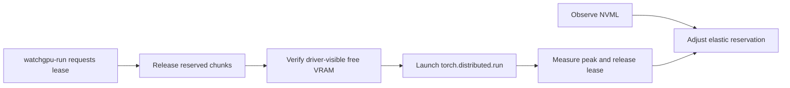

# WatchGPU

> Elastic VRAM reservation and cooperative PyTorch launching for shared, single-node NVIDIA GPU servers.

[](https://github.com/zcluu/GPU-Watcher/actions/workflows/ci.yml)
[](https://www.python.org/)
[](LICENSE)

[简体中文](README.zh-CN.md) | English

WatchGPU is a user-space service for teams that intentionally share GPU servers without a cluster scheduler. It observes local NVML state, keeps an elastic and immediately reclaimable VRAM reservation, and releases that reservation before launching a managed PyTorch job.

It needs no root access, does not require a shared home directory, and never signals unrelated GPU processes.

> [!IMPORTANT]
> WatchGPU is a cooperative tool, not a quota, lock, or scheduler. Use it only where the server owner and team policy permit user-managed reservations. Prefer Slurm, Kubernetes, LSF, or another administrator-provided scheduler when one is available.


## Highlights

- **Elastic reservations**: follows changing free VRAM while preserving a configurable safety margin.
- **Verified release**: waits for NVML to confirm that driver-visible memory was returned before approving a training lease.
- **PyTorch launcher**: a familiar `torchrun`-style command with atomic single- or multi-GPU requests.
- **Automatic profiling**: learns peak VRAM for a task and recommends a future request with a safety margin.
- **Live operations**: terminal console, status, pause/resume, policy updates, safe stop, and controlled restart.
- **Host-local by design**: discovers GPU UUIDs, Python, XDG paths, and background capabilities independently on every server.

## Requirements

| Component | Requirement |
|---|---|
| Operating system | Linux with `/proc`, Unix sockets, and same-UID process inspection |
| GPU | NVIDIA GPU with a working driver and NVML |
| Python | 3.11 or 3.12 |
| PyTorch | A CUDA-enabled PyTorch 2.x build installed by the operator |
| Permissions | Normal user account; root is not required |

MIG-backed allocation is not supported in the current release. WatchGPU reports MIG mode and rejects MIG-enabled devices until instance-aware allocation is implemented.

## Quick Start

Install a CUDA-enabled PyTorch build appropriate for your driver first. WatchGPU deliberately does not install or replace PyTorch.

```bash
git clone https://github.com/zcluu/GPU-Watcher.git
cd GPU-Watcher
./install-watchgpu
```

The helper uses the active Python environment. You can select another interpreter or a named conda/mamba environment:

```bash
WATCHGPU_PYTHON=/path/to/python ./install-watchgpu
WATCHGPU_ENV_NAME=gpu-tools ./install-watchgpu
```

Standard package installation is also supported:

```bash
python -m pip install .
watchgpu doctor
```

Preview the policy without allocating memory, then start the service:

```bash
watchgpu start -g 0,1 -f 2 --dry-run
watchgpu start -g 0,1 -f 2
```

Capacity values without a unit are GiB, including decimals. `2`, `2.5`, `2GiB`, and `2560MiB` are valid.

Launch a managed single-GPU task:

```bash
watchgpu-run \
  -t resnet-training \
  -n 1 \
  -m 12 \
  -g 0 \
  train.py --config configs/resnet.yaml
```

When the peak is unknown, use `auto` for an initial profiling run:

```bash
watchgpu-run \
  -t resnet-training \
  -n 1 \
  -m auto \
  -g 0 \
  train.py --config configs/resnet.yaml
```

Open the live console from another terminal:

```bash
watchgpu console
```

Run the included bounded CUDA smoke workload for an end-to-end check:

```bash
watchgpu-run \
  -t watchgpu-smoke \
  -n 1 \
  -m 1 \
  -g 0 \
  examples/cuda_smoke_test.py --hold-mib 256 --steps 5
```

## How It Works



WatchGPU allocates its reservation in bounded chunks. A lease request pauses maintenance work, releases enough WatchGPU-owned chunks, verifies the release through NVML, and only then launches the training command with the approved GPU UUIDs. It cannot prevent an unrelated process from racing for newly freed memory.

For the full model, see [Architecture](docs/architecture.md).

## Operations

```bash
watchgpu status
watchgpu status --json
# Keys come directly from `watchgpu config show`
watchgpu config set maintenance_cpu_target_percent 25
watchgpu config set cpu_budget_percent=100
watchgpu config set maintenance_compute_enabled false

# Shortcuts remain available for frequent changes
watchgpu config set -f 3 --runtime-only
watchgpu config set -c 25 --runtime-only
watchgpu pause -g GPU-UUID
watchgpu resume -g GPU-UUID
watchgpu release -g GPU-UUID -m 2
watchgpu stop --release
```

WatchGPU uses user systemd when available and otherwise falls back to a detached process. If user lingering is disabled, the detached process may remain tied to the login session; this is reported as `SESSION_BOUND`.

See [Configuration](docs/configuration.md) and [Troubleshooting](docs/troubleshooting.md) for details.

`--cpu-target/-c` configures transparent CPU health work for the whole
service on its shared affinity core: `0` (default) disables it, `50` targets
about half a logical core, and `100` targets at most one logical core. Multiple
GPU workers split this target instead of multiplying it. The work is bounded
checksum computation, remains interruptible for IPC, and yields immediately for
leases, pauses, shutdown, or the `--cpu-limit/-b` hard limit. Status and Console
show the configured target, observed process-tree usage, and maintenance state.

`watchgpu config set KEY VALUE` and `watchgpu config set KEY=VALUE` use the same
field names shown by `watchgpu config show`, with the same validation and live
apply path as shortcut options. Do not combine a key assignment with shortcuts
in one command. Use `watchgpu restart schedule set` for the structured
`maintenance_restart` setting.

Upgrade and removal procedures are documented in [Operations](docs/operations.md).

## Python SDK

Request a lease before importing or initializing CUDA-dependent model code:

```python
from watchgpu import MemoryRequest, acquire

with acquire(MemoryRequest(task_name="experiment-42", gpu="0", mib=12_000)) as lease:
    # Import or initialize CUDA workloads only after the lease is active.
    train(lease.device)
```

Calling `acquire` after PyTorch has initialized CUDA is rejected because WatchGPU can no longer provide a reliable pre-allocation guarantee. See [SDK Usage](docs/sdk.md).

## Safety and Trust Boundary

- WatchGPU only frees memory allocated by its own workers.
- Stop and restart operations do not send signals to managed training or external GPU processes.
- Processes sharing the same Unix UID share the same control trust boundary. Shared Unix accounts are not supported.
- Local state can contain task names, PIDs, GPU UUIDs, and absolute Python paths. Redact `doctor --json`, `status --json`, and logs before posting them publicly.
- Maintenance compute is transparent, bounded, and configurable; worker identities are not disguised.

Read [Responsible Use and Security Boundaries](docs/safety.md) before deployment.

## Development

```bash
python -m pip install -e '.[dev]'
python -m ruff check src tests examples scripts
python -m mypy src/watchgpu
python -m pytest -q
```

CPU-only CI runs the unit and integration suite on Python 3.11 and 3.12. CUDA/NVML tests are explicitly gated and must be run on a suitable NVIDIA host.

See [CONTRIBUTING.md](CONTRIBUTING.md) for contribution guidelines.

## Status

WatchGPU is an alpha release. It currently supports single-node launches only and has not implemented MIG-instance-aware allocation or hard resource isolation.

## License

Licensed under the [Apache License 2.0](LICENSE).
