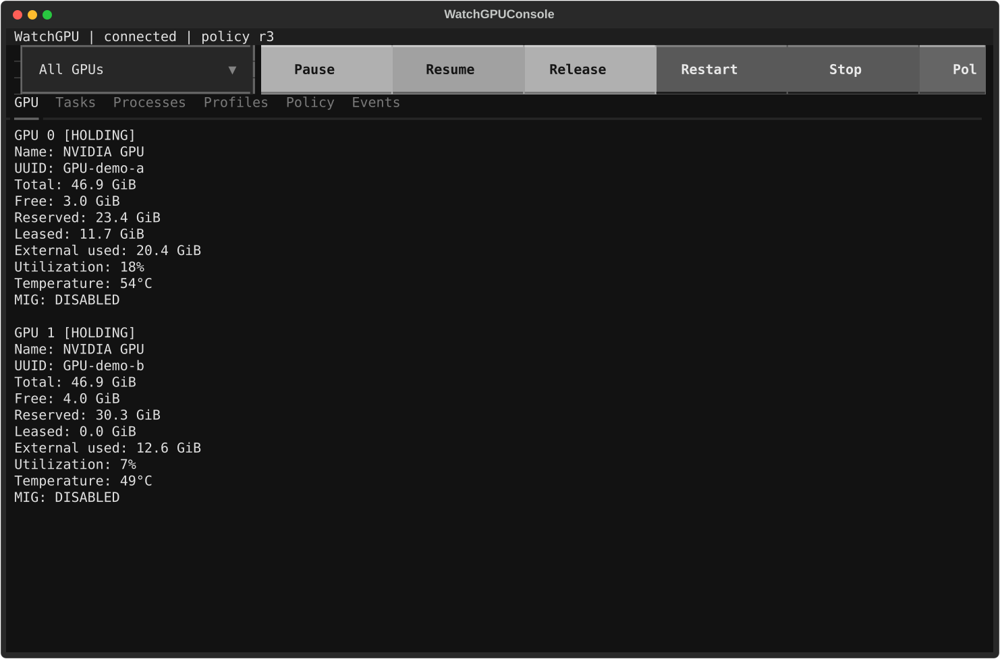
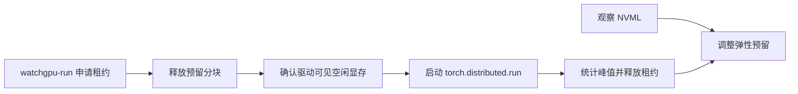

# WatchGPU

> 面向共享单机 NVIDIA GPU 服务器的弹性显存预留与协作式 PyTorch 启动工具。

[](https://github.com/zcluu/GPU-Watcher/actions/workflows/ci.yml)
[](https://www.python.org/)
[](LICENSE)

简体中文 | [English](README.md)

WatchGPU 适用于团队明确允许共享、但尚未部署集群调度器的 GPU 服务器。它通过 NVML 观察本机状态，动态维持一份可以立即回收的显存预留，并在启动受管 PyTorch 任务前释放对应显存。

它不需要 root、不依赖共享 home，也不会向无关 GPU 进程发送信号。

> [!IMPORTANT]
> WatchGPU 是协作工具，不是显存配额、排他锁或调度器。只能在服务器所有者和团队策略允许的情况下使用。已有 Slurm、Kubernetes、LSF 等正式调度器时，应优先使用正式调度系统。



## 核心能力

- **弹性预留**：根据空闲显存变化自动调整，同时保留可配置的安全余量。
- **驱动确认释放**：训练租约批准前，等待 NVML 确认显存已真实归还驱动。
- **PyTorch 启动器**：采用接近 `torchrun` 的命令方式，支持单卡和多卡原子申请。
- **自动画像**：统计任务峰值显存并为后续运行生成带余量的推荐值。
- **在线控制**：提供终端控制台、状态、暂停/恢复、热配置、安全停止和受控重启。
- **逐服务器发现**：GPU UUID、Python、XDG 路径和后台运行方式均在本机动态确定。

## 环境要求

| 组件 | 要求 |
|---|---|
| 操作系统 | Linux，具备 `/proc`、Unix socket 和同 UID 进程检查能力 |
| GPU | NVIDIA GPU，驱动和 NVML 工作正常 |
| Python | 3.11 或 3.12 |
| PyTorch | 用户预先安装的 CUDA 版本 PyTorch 2.x |
| 权限 | 普通用户权限，无需 root |

当前版本尚不支持基于 MIG instance 的分配。WatchGPU 会显示 MIG 状态，并在实现 instance-aware 分配前拒绝管理已启用 MIG 的设备。

## 三分钟上手

首先安装与你的驱动匹配、能够访问 CUDA 的 PyTorch。WatchGPU 不会安装或替换 PyTorch。

```bash
git clone https://github.com/zcluu/GPU-Watcher.git
cd GPU-Watcher
./install-watchgpu
```

安装脚本默认使用当前 Python，也可以指定解释器或任意 conda/mamba 环境名：

```bash
WATCHGPU_PYTHON=/path/to/python ./install-watchgpu
WATCHGPU_ENV_NAME=gpu-tools ./install-watchgpu
```

也可以使用标准 Python 包安装方式：

```bash
python -m pip install .
watchgpu doctor
```

先预览策略（不分配显存、不保存配置），再启动服务：

```bash
watchgpu start --gpus 0,1 --leave-free 2 --dry-run
watchgpu start --gpus 0,1 --leave-free 2
```

容量参数省略单位时默认按 GiB，并支持小数。`2`、`2.5`、`2GiB` 和 `2560MiB` 都是合法输入。

启动一个受管单卡任务：

```bash
watchgpu-run \
  --task resnet-training \
  --nproc-per-node=1 \
  --memory-per-gpu=12 \
  --devices=0 \
  train.py --config configs/resnet.yaml
```

不清楚显存峰值时，可以先进行一次自动画像：

```bash
watchgpu-run \
  --task resnet-training \
  --nproc-per-node=1 \
  --memory-per-gpu=auto \
  --devices=0 \
  train.py --config configs/resnet.yaml
```

在另一个终端打开实时控制台：

```bash
watchgpu console
```

使用仓库自带的低显存 CUDA 任务完成端到端验证：

```bash
watchgpu-run \
  --task watchgpu-smoke \
  --nproc-per-node=1 \
  --memory-per-gpu=1 \
  --devices=0 \
  examples/cuda_smoke_test.py --hold-mib 256 --steps 5
```

## 工作流程



WatchGPU 按有限大小的分块建立预留。收到租约申请后，它会暂停维护计算、释放自己的预留、通过 NVML 确认显存归还，然后才使用获批 GPU UUID 启动训练。它不能阻止无关进程竞争刚刚释放的显存。

详细设计参见[架构说明（英文）](docs/architecture.md)。

## 常用运维命令

```bash
watchgpu status
watchgpu status --json
watchgpu config set --leave-free 3 --runtime-only
watchgpu pause GPU-UUID
watchgpu resume GPU-UUID
watchgpu release GPU-UUID 2
watchgpu stop --release
```

WatchGPU 优先使用 user systemd，不可用时退化为 detached 进程。若用户 lingering 未开启，后台进程可能受登录会话生命周期影响，程序会明确显示 `SESSION_BOUND`。

更多信息参见[配置说明（英文）](docs/configuration.md)和[故障排查（英文）](docs/troubleshooting.md)。

升级和卸载步骤参见[运维说明（英文）](docs/operations.md)。

## Python SDK

必须在导入或初始化依赖 CUDA 的模型代码之前申请租约：

```python
from watchgpu import MemoryRequest, acquire

with acquire(MemoryRequest(task_name="experiment-42", gpu="0", mib=12_000)) as lease:
    # 只在租约生效后导入或初始化 CUDA 工作负载。
    train(lease.device)
```

如果 PyTorch 已经初始化 CUDA，`acquire` 会明确拒绝申请，因为此时无法再提供可靠的预分配保证。完整接口参见 [SDK 使用说明（英文）](docs/sdk.md)。

## 安全边界

- WatchGPU 只释放自己 worker 分配的显存。
- 停止和重启不会向训练进程或外部 GPU 进程发送信号。
- 同一 Unix UID 下的进程处于同一控制信任边界，不支持多人共享同一 Unix 账号。
- 本机状态可能包含任务名、PID、GPU UUID 和 Python 绝对路径。公开提交 `doctor --json`、`status --json` 或日志前必须脱敏。
- 维护计算透明、受限且可配置，不会伪装 worker 身份。

部署前请阅读[负责任使用与安全边界（英文）](docs/safety.md)。

## 开发

```bash
python -m pip install -e '.[dev]'
python -m ruff check src tests examples scripts
python -m mypy src/watchgpu
python -m pytest -q
```

公开 CI 在 Python 3.11 和 3.12 上运行无 GPU 单元及集成测试。CUDA/NVML 测试需要在合适的 NVIDIA 主机上显式启用。

贡献方式参见 [CONTRIBUTING.md](CONTRIBUTING.md)。

## 当前状态

WatchGPU 目前处于 Alpha 阶段，只支持单机启动，尚未实现 MIG instance-aware 分配和硬件级资源隔离。

## 许可证

本项目采用 [Apache License 2.0](LICENSE)。
